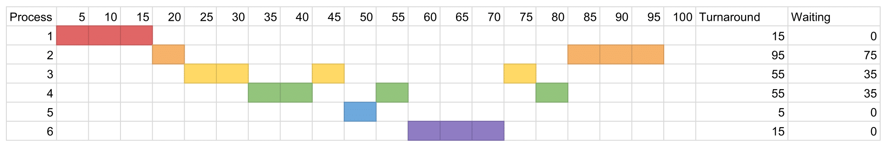

## 4.8

1. Sequence operations where each operation depends on previous execution results
2. I/O bound operations

## 4.10

(b) (c)

## 4.16

1. Single thread, because I/O bound operations don't benefit from multithreading.
2. 4 threads, tasks can be spread across threads for maximum utilization.

## 5.14

(1)

Advantage: Less prone to race conditions
Disadvantage: Potential imbalance

(2)

Advantage: Inherent load balancing
Disadvantage: Prone to race conditions

## 5.18



## 5.22

(a)

$$
\frac{1 + 1 \times 10}{11 + 0.1 \times 11} \approx 90.9\%
$$

(b)

$$
\frac{10 + 10 \times 10}{110 + 0.1 \times 11} \approx 99.0\%
$$

## 5.25

(a) No preference towards shorter processes

(b) No preference towards shorter processes

(c) Promotes shorter processes

## 6.7

(a) `stack`, `top`

(b)

```c
push(item) {
  lock(&mutex);
  if (top < SIZE) {
    stack[top] = item;
    top++;
    unlock(&mutex);
  } else {
    unlock(&mutex);
    ERROR
  }
}

pop(*result) {
  lock(&mutex);
  if (!is_empty) {
    top--;
    *reuslt = stack[top];
    unlock(&mutex);
    return;
  } else {
    unlock(&mutex);
    ERROR
  }
}

is_empty() {
  if (top == 0) {
    return true;
  } else {
    return false;
  }
}
```

## 6.15

Can cause I/O devices to not function properly

## 6.18

`block()` moves the process into waiting queue
`wakeup()` recovers the said process from the waiting queue
